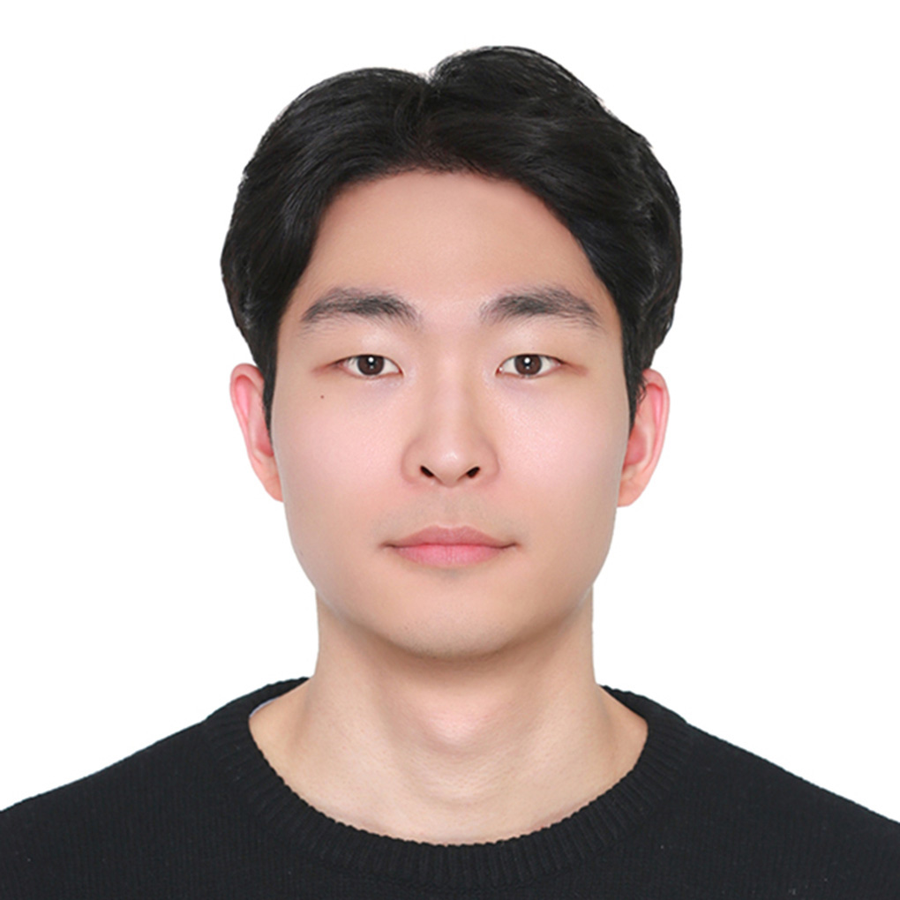

I'm Kyungmin Kim, a Master's student at the Seoul National University (SNU), advised by [Sang-Won Lee](https://swlee69.github.io/).  
I received my B.S from Sungkyunkwan University (SKKU) in 2023.

[[CV]](assets/cv/cv.pdf) / [[Google Scholar]](https://scholar.google.com/citations?user=S643eSgAAAAJ&hl=en) / [[Github]](https://github.com/lufovic77) / [[email]](mailto:kyungminkim@snu.ac.kr)
